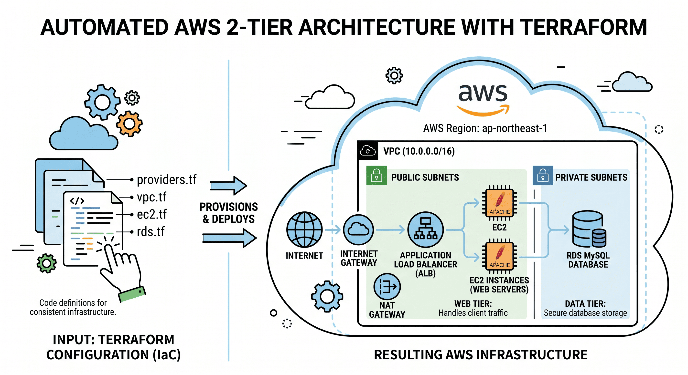
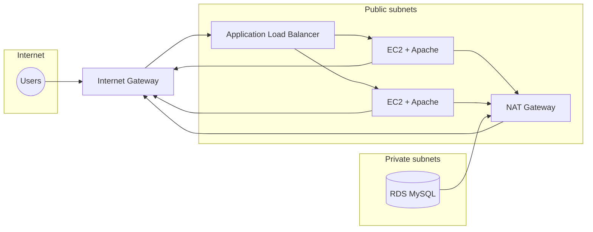

# Automated-AWS-Terraform-App

Infrastructure-as-code for a **two-tier AWS architecture**: a **public web tier** (Amazon EC2 instances registered behind an **Application Load Balancer**) and a **private data tier** (**Amazon RDS for MySQL**). Networking, security groups, routing, and the load balancer are defined in Terraform so you can reproduce the stack in a consistent way.

This repository intentionally contains **only** that 2-tier stack. Terraform files live at the **repository root** (no nested `2-Tier-Architecture` folder).

---

## Table of contents

- [What this stack deploys](#what-this-stack-deploys)
- [Architecture](#architecture)
  - [Reference diagram](#reference-diagram)
  - [Mermaid flow diagram](#mermaid-flow-diagram)
- [Network layout](#network-layout)
- [Repository layout](#repository-layout)
- [Requirements](#requirements)
- [Before you run Terraform](#before-you-run-terraform)
- [Deploy](#deploy)
- [After deployment](#after-deployment)
- [Customization](#customization)
- [Security and operations notes](#security-and-operations-notes)
- [Cost awareness](#cost-awareness)
- [Destroy](#destroy)
- [Troubleshooting](#troubleshooting)
- [Contributing](#contributing)
- [License](#license)

---

## What this stack deploys

| Area | AWS resources (as defined in this repo) |
|------|----------------------------------------|
| **Networking** | VPC `10.0.0.0/16`, two **public** subnets, two **private** subnets, Internet Gateway, **NAT Gateway** with Elastic IP, public and private **route tables** and associations |
| **Web tier** | Two **EC2** instances (`t2.micro`), Amazon Linux 2, **user data** installs and starts **Apache** (`httpd`) on port **80** |
| **Load balancing** | One **internet-facing Application Load Balancer** (`My-lb`), **target group** on HTTP 80, **listener** forwarding to the target group, **two target group attachments** to the EC2 instances |
| **Security groups** | SG for the ALB (`My-SG`), SG for EC2 web/SSH (`Custom-Public-SG-DB`), SG for RDS (`My_database_tier_lu`) |
| **Data tier** | **RDS** MySQL **5.7** (`db.t2.micro`), **10 GiB** storage, **DB subnet group** spanning the two private subnets |

Default **AWS region** is **`ap-northeast-1`** (Tokyo). Default **Terraform** and **AWS provider** versions are pinned in `providers.tf`.

---

## Architecture

High-level traffic flow: **clients → Internet → ALB (public subnets) → EC2 (public subnets)**. **RDS** runs only in **private** subnets; it does not receive a public endpoint from this template. Private subnets use the **NAT Gateway** for outbound connectivity (for example, patches), while public subnets use the **Internet Gateway** for the default route.

The sections below show the same idea two ways: a **reference diagram** checked into this repo (`assets/aws-app-architecture.png`) and a **Mermaid** diagram you can edit inline in the README.

### Reference diagram

The following asset summarizes **Terraform as input** (`providers.tf`, `vpc.tf`, `ec2.tf`, `rds.tf`) and the **resulting AWS footprint** in **`ap-northeast-1`**: VPC **`10.0.0.0/16`**, Internet Gateway and NAT Gateway, **web tier** (ALB and Apache EC2 instances in public subnets), and **data tier** (RDS MySQL in private subnets).



*Repository file:* [`assets/aws-app-architecture.png`](assets/aws-app-architecture.png)

### Mermaid flow diagram



---

## Network layout

All CIDRs and AZs are **hard-coded** in `vpc.tf` and `ec2.tf`; change them there if you move to another region or IP plan.

| Resource | CIDR or detail |
|----------|----------------|
| VPC | `10.0.0.0/16` |
| Public subnet 1 | `10.0.1.0/24` — **ap-northeast-1a** |
| Public subnet 2 | `10.0.2.0/24` — **ap-northeast-1c** |
| Private subnet 1 | `10.0.3.0/24` — **ap-northeast-1a** |
| Private subnet 2 | `10.0.4.0/24` — **ap-northeast-1c** |

- **Public** subnets: associated with a route table whose default route (`0.0.0.0/0`) targets the **Internet Gateway**.
- **Private** subnets: associated with a route table whose default route targets the **NAT Gateway** (deployed in a public subnet).

---

## Repository layout

| File | Responsibility |
|------|----------------|
| [`providers.tf`](providers.tf) | Terraform block: `required_version` **~> 1.4.6**, `hashicorp/aws` **~> 4.57.0**; AWS provider **region** |
| [`vpc.tf`](vpc.tf) | VPC, subnets, IGW, EIP, NAT, route tables, DB subnet group, ALB security group, EC2 security group, ALB, target group, attachments, listener |
| [`ec2.tf`](ec2.tf) | Two web EC2 instances, AMI, key pair, user data for Apache |
| [`rds.tf`](rds.tf) | RDS MySQL instance and database security group |
| [`assets/aws-app-architecture.png`](assets/aws-app-architecture.png) | Reference architecture diagram (used in [Architecture](#architecture)) |
| [`LICENSE`](LICENSE) | MIT License |

There is **no** `variables.tf` or `outputs.tf` in this repo yet; values such as AMI ID, key name, and DB credentials are set **inline** in the `.tf` files.

---

## Requirements

- **AWS account** with permissions to create VPC, subnets, gateways, NAT, EC2, ELB (ALB), and RDS.
- **Terraform** **1.4.x** (see `required_version` in `providers.tf`).
- **AWS CLI** (optional but useful for credentials and debugging).
- An **EC2 key pair** in **`ap-northeast-1`** named **`mykeypair`**, unless you change `key_name` in `ec2.tf`.

---

## Before you run Terraform

1. **Key pair**  
   Create or import a key pair in the EC2 console for **ap-northeast-1** named **`mykeypair`**, or edit `ec2.tf` to use your key name.

2. **AMI**  
   Both instances use AMI **`ami-0d52744d6551d851e`** (commented as Amazon Linux 2 in `ec2.tf`). AMIs are **region-specific** and can be **deprecated** over time. If `terraform apply` fails on AMI lookup, pick a current **Amazon Linux 2** AMI for **ap-northeast-1** and update `ec2.tf`.

3. **Naming collisions**  
   Resource names such as **`My-lb`**, **`My-SG`**, **`Customtargetgroup`**, and **`my-custom-subgroup`** must be **unique** in the account/region. If a previous apply partially failed or left names behind, either delete the old resources or adjust names in `vpc.tf` / `rds.tf`.

4. **Credentials**  
   Configure AWS credentials via environment variables, shared credentials file, or an IAM role (for example on an EC2 runner). The provider does not embed keys.

---

## Deploy

From the **repository root**:

```bash
terraform init
terraform plan
terraform apply
```

Confirm with **`yes`** when prompted. First apply can take **several minutes** (RDS and NAT Gateway are slow compared with simple EC2).

Optional: use an auto-approved apply only in non-production sandboxes:

```bash
terraform apply -auto-approve
```

---

## After deployment

- **Web traffic**  
  In the AWS Console, open **EC2 → Load Balancers**, select **`My-lb`**, and copy the **DNS name** (for example `My-lb-xxxx.ap-northeast-1.elb.amazonaws.com`). Open **`http://<dns-name>/`** in a browser. You should see the simple HTML page installed by user data (slightly different text per instance; the ALB may show either target).

- **Outputs**  
  This project does not define `output` blocks. To avoid using the console, you can add to a new `outputs.tf` file, for example:

  ```hcl
  output "alb_dns_name" {
    value = aws_lb.My-lb.dns_name
  }
  ```

  Then run `terraform output`.

- **SSH to EC2**  
  Security group **`Custom-Public-SG-DB`** allows **TCP 22** from **0.0.0.0/0**. Use your private key and the instance public IP (or Session Manager if you refactor to use it).

- **RDS**  
  Endpoint and port appear in **RDS → Databases** in the console. Master user and password are currently set in **`rds.tf`** (see security notes below). The database security group includes a **non-default MySQL-related port (8279)** in one ingress rule; default MySQL is **3306**. Align port, parameter group, and application configuration if you intend to connect from the app tier.

---

## Customization

Typical edits (all require `terraform plan` before apply):

| Goal | Where to look |
|------|----------------|
| Change **region** | `providers.tf` (`region`), and update **subnet AZs**, **AMI**, and **key pair** to match the new region |
| Different **instance type** or **count** | `ec2.tf` (and possibly target group attachments in `vpc.tf`) |
| **HTTPS** on the ALB | Add ACM certificate in the region, listener on **443**, and security group rules as needed (not present in the current template) |
| **Secrets** for RDS | Replace inline `username` / `password` with `variable` + `terraform.tfvars` (untracked) or AWS Secrets Manager / SSM (requires more Terraform) |
| **Remove NAT** | Only if you accept no outbound internet from private subnets; would require editing `vpc.tf` and private route tables |

---

## Security and operations notes

This repository is suitable for **learning** and **sandboxes**. For production you would normally tighten several choices that exist in the code today:

- **Load balancer security group (`My-SG`)** allows **all inbound** (`0.0.0.0/0` on all ports in one rule). Restrict to **80** (and **443** if you add TLS) from the internet.
- **EC2 security group** allows **SSH and HTTP from anywhere** (`0.0.0.0/0`).
- **RDS security group** allows **SSH from 0.0.0.0/0** in addition to database-related rules—database tiers usually should **not** expose SSH from the public internet.
- **Master password** is **plaintext** in `rds.tf`. Treat this as **temporary**; rotate credentials and move secrets out of Git.
- **MySQL 5.7** on RDS is **legacy**; plan an upgrade path to a supported engine version for long-lived environments.

Review AWS **Security Groups** and **Network ACLs** after every `apply` to confirm they match your risk tolerance.

---

## Cost awareness

Billable components include (non-exhaustive): **two EC2 t2.micro**, **Application Load Balancer**, **NAT Gateway** and **Elastic IP**, **RDS db.t2.micro** storage and instance hours, and **data transfer**. **NAT Gateways** are often the largest surprise cost in small VPCs. Destroy resources when you are done experimenting.

---

## Destroy

From the repository root:

```bash
terraform destroy
```

Confirm with **`yes`**. This tears down managed resources; **RDS** is created with **`skip_final_snapshot = true`** in `rds.tf`, so **no final DB snapshot** is taken by default—data is not retained after destroy unless you change that setting.

---

## Troubleshooting

| Symptom | Things to check |
|---------|------------------|
| **`terraform apply` fails on AMI** | AMI ID invalid or retired for **ap-northeast-1**; select a new Amazon Linux 2 AMI. |
| **Key pair error** | Key name **`mykeypair`** missing in the region; create it or change `key_name` in `ec2.tf`. |
| **ALB or SG name already exists** | Unique name conflict; rename in `vpc.tf` or remove the old resource. |
| **502 / unhealthy targets** | Apache still installing; wait and refresh. Check target group **health checks** (defaults apply to HTTP on instance port 80). Security groups must allow **80** from the ALB to instances (currently web SG allows 80 from `0.0.0.0/0`). |
| **RDS subnet group error** | Private subnets must exist in **at least two** AZs for the default subnet group pattern used here. |

---

## Contributing

Issues and pull requests are welcome. If you change behavior (for example, security groups or engine version), update this **README** so it stays aligned with the Terraform.

---

## License

This project is licensed under the **MIT License**. See [LICENSE](LICENSE).
